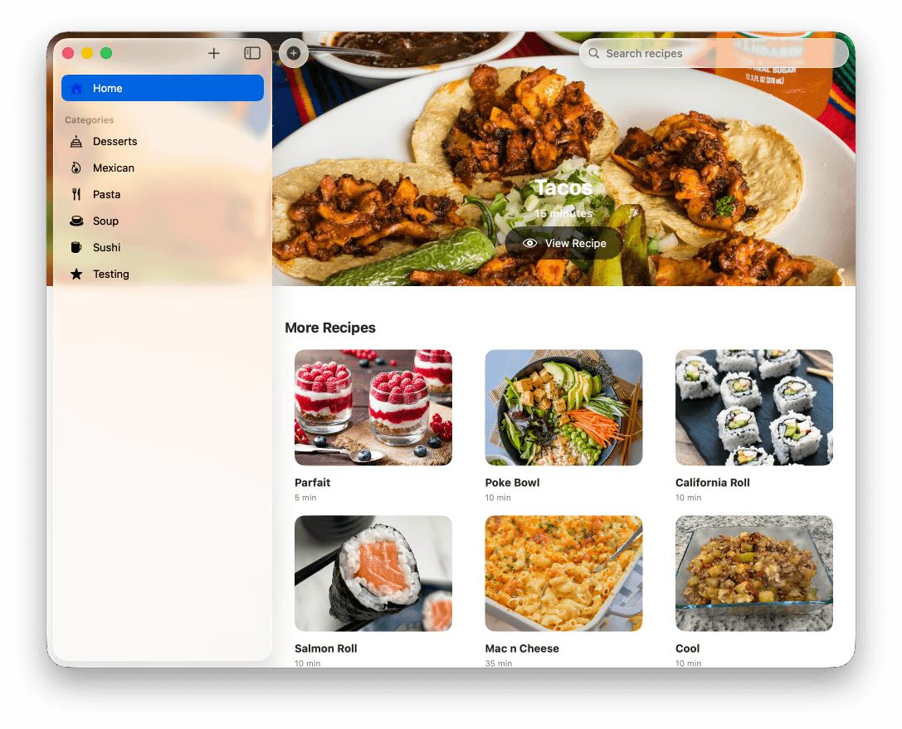

<div align="center">

<picture>
  <source srcset="Documentation/icon-dark.png" media="(prefers-color-scheme: dark)">
  <source srcset="Documentation/icon-light.png" media="(prefers-color-scheme: light)">
  
</picture>
<br/><br/>

macOS / iPadOS / iOS frontend for iCook Recipe Server.

</div>

<p align="center">
    <a href="Documentation/App1.png"></a>
</p>

<details>
<summary>Work in Progress</summary>
- Fix search UI
</details>

<details>
<summary>Completed</summary> 
- Working
</details>


<!-- ## 🖥️ Features, Tools, and Settings

### Features

- View current defailt mail app. 
- Set new default mail app. 
- Test default mail app by generating a test .eml file. 


## Why does this exist?

Great question! Here's the thing: macOS has this quirky relationship with .eml files. While you can easily set default apps for .jpg, .pdf, or .mp3 files, Apple makes it very difficult to set a default for .eml. 


## FAQ

**Q: Will this break anything?**  
A: Nope! MacMailPicker only changes .eml file associations.

**Q: What if I want to change my mind later?**  
A: Just run MacMailPicker again and pick a different app.

**Q: Does this work with [insert email app here]?**  
A: If it can open .eml files, MacMailPicker can probably find it and use it.

**Q: Why didn't Apple just fix this?**  
A: Great question! I've been wondering the same thing.  🤷‍♂️


## 🖥️ Install & Minimum Requirements

- macOS 14.0 or later  
- Apple Silicon & Intel (Not tested on Intel)
- ~20 MB free disk space  


### ⚙️ Installation

Download from Releases. It's signed & notarized!

### ⚙️ Build it yourself!

Clone the repo and build with Xcode:

```bash
git clone https://github.com/gbabichev/MacMailPicker.git
cd MacMailPicker
open "MacMailPicker.xcodeproj"
```

## 📝 Changelog

### 1.0 
- Initial Release. 

## 📄 License

MIT — free for personal and commercial use. 


## Contributing

Found a bug? Have an idea? Want to add support for your favorite obscure email client from 1987? I'd love to hear from you!

 -->
