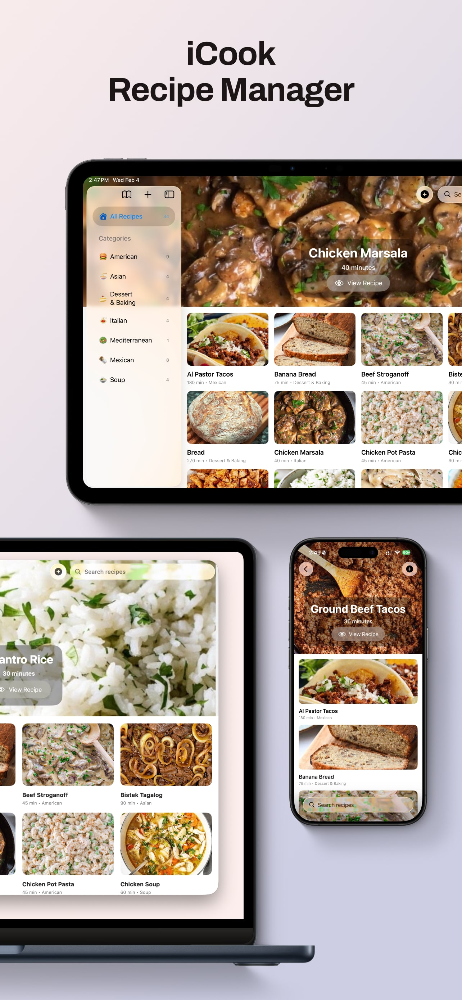

<picture>
  <source srcset="Documentation/icon-dark.png" media="(prefers-color-scheme: dark)">
  <source srcset="Documentation/icon-light.png" media="(prefers-color-scheme: light)">
  
</picture>
  

<h2>iCook is a fast, focused recipe app for organizing, sharing, and cooking. </h2>
  

    

<!-- 

    

    
    

    
    

 -->

## Features

🗂 Collections & Categories  
Organize recipes into collections (think, recipe books), then group them by category.

🧾 Rich Recipes  
Add details, time, steps, and ingredients — plus photos for every recipe.

🤝 iCloud Sharing  
Share collections with family or friends and collaborate in real time.

☁️ iCloud Sync  
Your recipes stay up-to-date across all your Apple devices.

✅ Integration with Apple Reminders  
Easily copy and paste ingredients from your recipes into your shopping list in Reminders.

🧘‍♂️ Just Recipes — Nothing Else  
No ads. No tracking. No in-app purchases.  
Just a clean, focused space for your cooking.

## 🖥️ Install & Minimum Requirements

- macOS 26.0 or later  
- Apple Silicon & Intel
- ~20 MB free disk space  
- Free space in iCloud for recipe storage

### ⚙️ Installation

App Store Coming Soon
<!-- <a href="#">App Store for macOS, iOS, and iPadOS Coming Soon</a> -->

## 📝 Changelog

### 1.0.0
- Initial Release.

## 📄 License

MIT — free for personal and commercial use. 

## Privacy
<a href="Documentation/PrivacyPolicy.html">Privacy Policy</a>

## Support 
<a href="Documentation/Support.html">Support</a>
