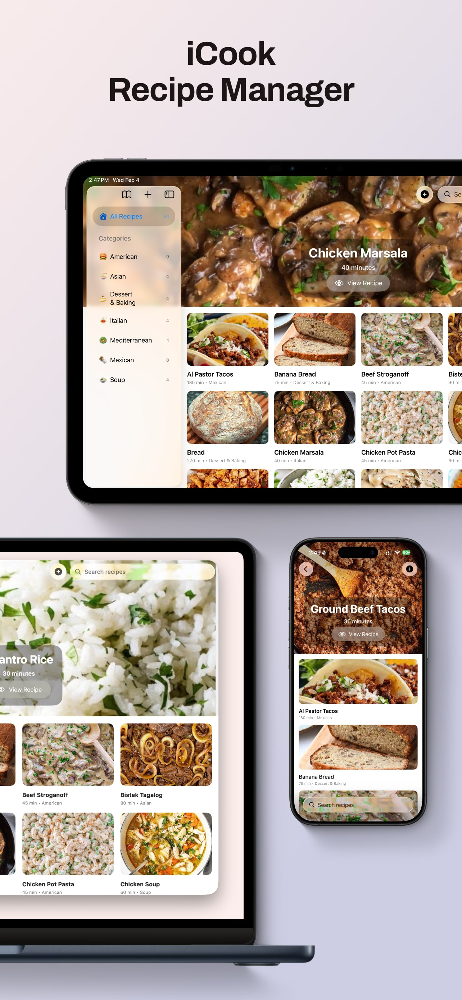
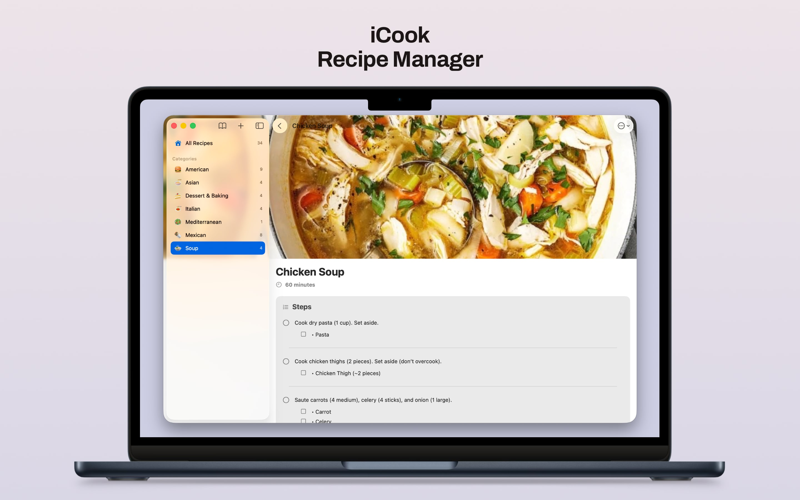
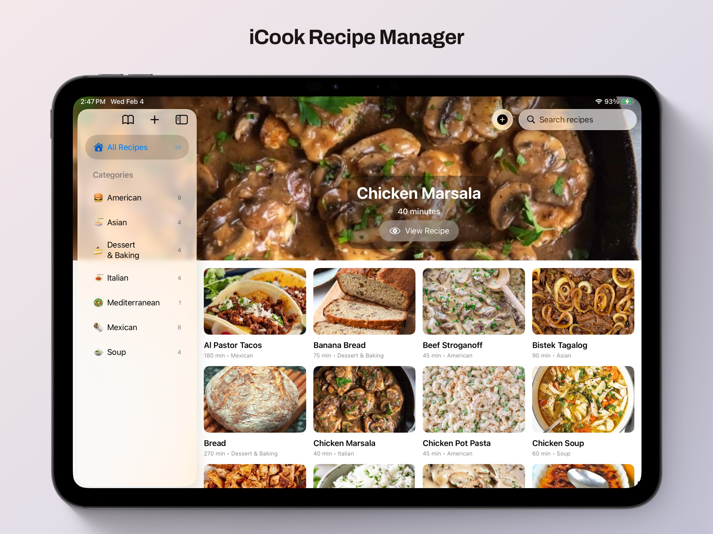
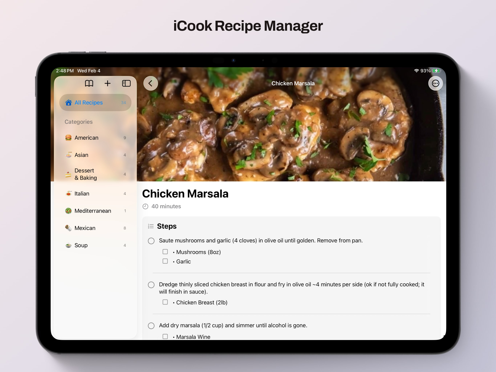
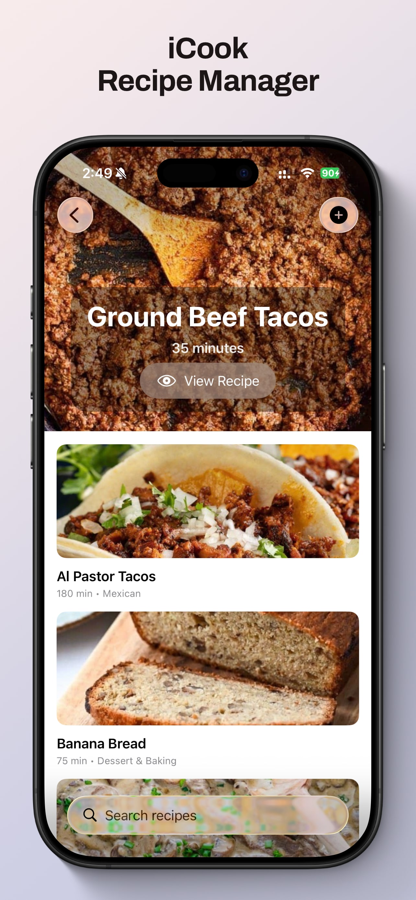
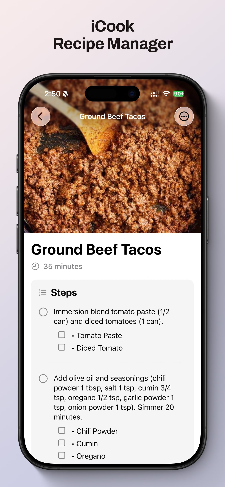

<div align="center">

<picture>
  <source srcset="docs/icon-dark.png" media="(prefers-color-scheme: dark)">
  <source srcset="docs/icon-light.png" media="(prefers-color-scheme: light)">
  
</picture>
<br/><br/>

<h2>iCook is a fast, focused recipe app for organizing, sharing, and cooking.<br></h2>
<p>
  <a href="https://gbabichev.github.io/iCook/">Website</a> ·
  <a href="https://gbabichev.github.io/iCook/Tutorial.html">Tutorial</a> ·
  <a href="https://gbabichev.github.io/iCook/Support.html">Support</a> ·
  <a href="https://gbabichev.github.io/iCook/PrivacyPolicy.html">Privacy</a>
</p>
<br><br>

</div>

<p align="center">
    <a href="docs/All.jpg"></a>
</p>

<!-- <p align="center">
    <a href="docs/Mac-1.jpg"></a>
</p>

<p align="center">
    <a href="docs/iPad-1.jpg"></a>
    <a href="docs/iPad-2.jpg"></a>
</p>

<p align="center">
    <a href="docs/iOS-1.jpg"></a>
    <a href="docs/iOS-2.jpg"></a>
</p> -->


## Features

🗂 Collections & Categories <br>
Organize recipes into collections (think, recipe books), then group them by category.

🧾 Rich Recipes <br>
Add details, time, steps, and ingredients — plus photos for every recipe.

🤝 iCloud Sharing <br>
Share collections with family or friends and collaborate in real time.

☁️ iCloud Sync <br>
Your recipes stay up-to-date across all your Apple devices.

✅ Integration with Apple Reminders <br>
Easily copy and paste ingredients from your recipes into your shopping list in Reminders.

🧘‍♂️ Just Recipes — Nothing Else <br>
No ads. No tracking. No in-app purchases. <br>
Just a clean, focused space for your cooking.


## 🖥️ Install & Minimum Requirements

- macOS / iPadOS / iOS 26.0 or later  
- Apple Silicon & Intel
- ~20 MB free disk space  
- Free space in iCloud for recipe storage


### ⚙️ Installation

App Store Coming Soon
<!-- <a href="#">App Store for macOS, iOS, and iPadOS Coming Soon</a> -->

## Export Format

iCook exports collections as a `.icookexport` file package.

Package layout:

```text
MyCollection.icookexport/
├── Recipes.json
└── Images/
    ├── <image files referenced by imageFilename>
    └── ...
```

`Recipes.json` is a UTF-8 JSON document with this top-level schema:

```json
{
  "source": {
    "name": "Family Recipes"
  },
  "categories": [
    {
      "name": "Dinner",
      "icon": "fork.knife",
      "lastModified": "2026-04-04T14:30:00Z"
    }
  ],
  "tags": [
    {
      "name": "Favorite",
      "lastModified": "2026-04-04T14:30:00Z"
    }
  ],
  "recipes": [
    {
      "exportID": "A1B2C3D4-E5F6-7890-1234-56789ABCDEF0",
      "name": "Tomato Soup",
      "recipeTime": 45,
      "details": "Best served warm.",
      "categoryName": "Dinner",
      "recipeSteps": [
        {
          "step_number": 1,
          "instruction": "Saute onions.",
          "ingredients": ["1 onion", "olive oil"]
        }
      ],
      "imageFilename": "tomato-soup.jpg",
      "tagNames": ["Favorite"],
      "isFavorite": true,
      "linkedRecipeExportIDs": ["11223344-5566-7788-99AA-BBCCDDEEFF00"],
      "linkedRecipeNames": ["Croutons"],
      "lastModified": "2026-04-04T14:30:00Z"
    }
  ]
}
```

Field notes:

- `source`: optional source-level metadata. Currently includes the exported collection `name`.
- `categories`: array of exported categories. Each category has `name`, `icon`, and optional `lastModified`.
- `tags`: array of exported tags. Older exports may omit this key entirely; import treats missing `tags` as an empty array.
- `recipes`: array of exported recipes, sorted by name when written.
- `exportID`: stable recipe identifier used to reconnect linked recipes during import. Optional for backward compatibility with older exports.
- `recipeTime`: integer number of minutes.
- `details`: optional freeform text.
- `categoryName`: category display name used to map the recipe during import.
- `recipeSteps`: ordered array of steps. Each step uses `step_number`, `instruction`, and `ingredients`.
- `imageFilename`: optional filename that maps to a file inside the package `Images/` folder.
- `tagNames`: optional array of tag names assigned to the recipe.
- `isFavorite`: optional boolean used to restore favorite state during import.
- `linkedRecipeExportIDs`: optional array of linked recipe export IDs. This is the preferred way to restore recipe-to-recipe links.
- `linkedRecipeNames`: optional fallback array of linked recipe names for older or partially resolvable imports.
- `lastModified`: optional ISO 8601 timestamp on categories, tags, and recipes.

Import compatibility notes:

- Plain `.json` exports are still readable, but packaged `.icookexport` files are the primary format because they preserve images.
- Missing `source`, `tags`, `tagNames`, `isFavorite`, `linkedRecipeExportIDs`, `linkedRecipeNames`, `details`, `imageFilename`, and `lastModified` are all valid and treated as optional.
- Images are referenced by filename only; the actual binary data lives in the package `Images/` directory, not inline in JSON.

## 📝 Changelog

### 1.0.0
- Initial Release.

## 📄 License

MIT — free for personal and commercial use. 

## Privacy
<a href="docs/PrivacyPolicy.html">Privacy Policy</a>

## Support 
<a href="docs/Support.html">Support</a>
